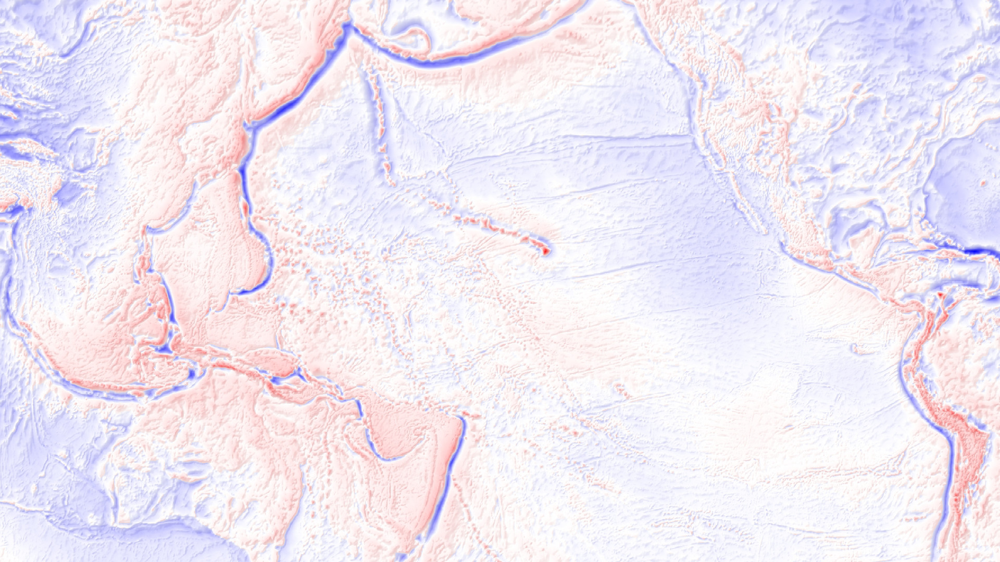

<!-- .slide: class="slide-title" data-background-image="img/title-slide-background.jpg" data-background-repeat="no-repeat" data-background-opacity="0.25" data-background-color="#000000" data-background-position="center" -->

# A slightly long talk title

## [Leonardo Uieda](https://www.leouieda.com)

[<i class="fab fa-twitter fa-fw"></i> @leouieda](https://twitter.com/leouieda)

*Location | Date*

---

<!-- .slide: class="slide-transition" data-background-color="rgb(25, 34, 55)" -->

# Background

---

# Normal slide

A image with:

* A bullet point
* description of it

Image from [this place](http://www.leouieda.com)

---

# Something else

Another citation or funny note.

---

<!-- .slide: class="slide-title" data-background-image="img/title-slide-background.jpg" data-background-repeat="no-repeat" data-background-opacity="0.25" data-background-color="#000000" data-background-position="center" -->

"Something or other"

Another citation or funny note.

---

<!-- CONTACT -->
<!-- ====================================================================== -->

<!-- .slide: class="slide-contact" data-background-color="rgb(25, 34, 55)" -->

# Contact

<ul class="fa-ul" style="">
<li><i class="fa-li fa fa-envelope"></i>

[Leonardo.Uieda@liverpool.ac.uk](mailto:Leonardo.Uieda@liverpool.ac.uk)

</li>
<li><i class="fa-li fab fa-twitter"></i>

[@leouieda](https://twitter.com/leouieda)

</li>
<li><i class="fa-li fa fa-desktop"></i>

[www.leouieda.com](https://www.leouieda.com)

</li>
</ul>

---

<!-- LICENSE -->
<!-- ====================================================================== -->

<!-- .slide: class="slide-license" -->

<i class="fab fa-creative-commons"></i><i class="fab fa-creative-commons-by"></i>

This presentation is licensed under a

[Creative Commons Attribution 4.0 International License](https://creativecommons.org/licenses/by/4.0/).

