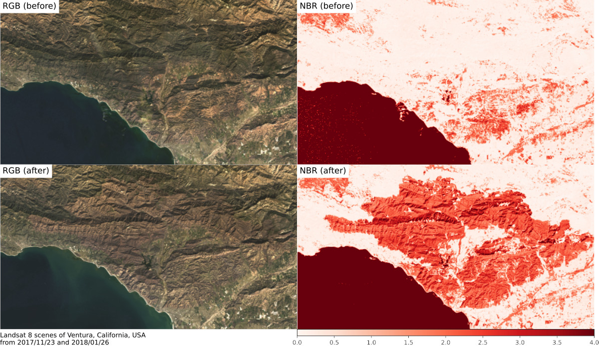

<!--
-------------------------------------------------------------------------------
This file defines the contents of each slide.
The reveal.js configuration can be found in index.html
-------------------------------------------------------------------------------
-->

<!-- .slide: class="slide-title" data-background-image="assets/title-slide.svg" data-background-color="#000000" data-background-size="contain" -->

<!-- Place the content at the bottom of the slide -->
<div class="r-stretch">
</div>

<h1 id="talk-title">
  A long talk title that may be kind of boring and more than one line long
</h1>
<p id="talk-authors">
  <span id="talk-speaker">Leonardo Uieda</span>,
  Author Two,
  and
  Author Three
</p>

<!-- Place location and date side-by-side with affiliation logos -->
<div class="row talk-info">
<div class="col-large">

Event/host of the talk | XX Month 202X

<!-- Permission to reuse and CC-BY license logo -->
<i class="fa fa-camera" style="margin: 0 10px 0 0"></i>
Feel free to screenshot/share/reuse this presentation
|
<a href="https://creativecommons.org/licenses/by/4.0/"><i class="fab fa-creative-commons"></i><i class="fab fa-creative-commons-by" style="margin: 0 10px 0 2px"></i> CC-BY 4.0 License</a>

</div>
<div class="col-medium">

<!-- Add logos here. Need these wrappers to align them to the bottom right -->
<div class="talk-logos-container">
<div class="talk-logos">
  
  <br>
  
</div>
</div>

</div>
</div>

===============================================================================

# Heading 1

This is a slide with some content.

## Heading 2

* Bla bla
* Bla bla

### Heading 3

Meh meh meh meh meh meh meh meh meh meh meh meh meh meh meh meh meh meh meh meh
meh meh.

===============================================================================

<div class="r-stretch">

# Some facts

About a certain topic.

</div>
<div class="footnote">

This is a little footnote.
Use it to add notes, citations, [links](https://www.leouieda.com/), etc.
<br>
Notice how the `div` above uses `r-stretch` to push this note to the bottom.

</div>

===============================================================================

<div class="r-stretch centered">
<div>

# Even more facts!

About many different things.

</div>
</div>
<div class="footnote-left">

Left aligned footnote.
Use `centered` on the `div` above to vertically center content.
<br>
Need to put another `div` inside of it as well.

</div>

===============================================================================

<!-- .slide: data-background-image="assets/agu2019.svg" data-background-size="contain" data-background-color="#000000" -->

<div class="r-stretch">
</div>
<div class="footnote-center dark">

Centered footnote with a dark background on a slide with a background.
<br>
Set the size to `contain` to make sure aspect ratios are preserved and the
background isn't cropped.
<br>
It's a good idea to add alt-text to this footnote if the background is
important.

</div>

===============================================================================

<!-- .slide: data-background-video="assets/brasil-sao-paulo-rio.mp4" data-background-size="contain" data-background-color="#000000" -->

<div class="r-stretch">
</div>
<div class="footnote">

This is how you use a video background.
The video auto starts when flipping to this slide.

</div>

===============================================================================

<!-- .slide: class="slide-transition" -->

# A transition slide <br> with a large title

...and some text.

===============================================================================

# Maths

This is an inline $\int_a^b x^2 dx$ and $\delta g = g - \gamma$:

`\[ \int_a^b x^2 dx \]`

===============================================================================

<!-- .slide: data-background-image="assets/agu2019.svg" data-background-size="contain" data-background-opacity="0.3" data-background-color="#000000" -->

<div class="quote">

Big quote message with a faded background image.
Bla bla bla bla bla bla bla bla bla bla bla bla bla bla bla.

</div>

===============================================================================

<!-- .slide: data-background-image="assets/agu2019.svg" data-background-size="contain" data-background-opacity="0.3" data-background-color="#ffffff" -->

<div class="quote dark">

Light fade of the background with a dark quote.

</div>

===============================================================================

# Two column layout

<div class="row">
<div class="col">

## Theory

Explain something here.
This is how you make a FontAwesome list:

<ul class="fa-ul">

<li>
<span class="fa-li"> <i class="fa fa-lightbulb fa-fw"></i> </span>
Make a list with
</li>

<li>
<span class="fa-li"> <i class="fa fa-file-alt fa-fw"></i> </span>
some awesome icons
</li>

<li>
<span class="fa-li"> <i class="fa fa-users fa-fw"></i> </span>
instead of bullet points
</li>

</ul>

</div>
<div class="col tiny">


Some text explaining the figure.
Maybe even a bit of maths like $\gamma$.

</div>
</div>

<div class="footnote">

Good place for a citation or image credit.
This one is by Leonardo Uieda (CC-BY).

</div>

===============================================================================

<div class="r-stretch centered">
<div>

# Multiple columns

Place as many `col`s as you want. They will have the same size.

<div class="row">
<div class="col">

Bla bla bla bla bla bla bla bla bla bla bla bla bla bla bla bla bla bla bla bla
bla bla.

</div>
<div class="col tiny">



Bla bla bla bla bla bla bla bla bla bla bla bla bla bla bla bla bla bla bla bla
bla bla.

</div>
<div class="col tiny">


Bla bla bla bla bla bla bla bla bla bla bla bla bla bla bla bla bla bla bla bla
bla bla.

</div>
</div>

</div>
</div>
<div class="footnote">

Images by Leonardo Uieda (CC-BY).

</div>

===============================================================================

# This one has columns of different size

<div class="row">
<div class="col-large tiny">


This way the image is larger on the screen. Use it for maps or main figures.

</div>
<div class="col small">

Explain what is shown on the image.
Use the `small` class to adjust font size.

Maybe include some maths:

$ D\dfrac{\partial^4 w}{\partial x^4} = q - g (\rho_m - \rho_w) w $

</div>
</div>

===============================================================================

<div class="row">
<div class="col tiny">


This way the image is narrow so it should be in a smaller column.

</div>
<div class="col-medium">

# Column sizes

Columns come in 3 sizes:

1. `col`
1. `col-medium`
1. `col-large`

These are more proportions than fixed sizes.

</div>
</div>

===============================================================================

# Code

Example of using PyGMT to make a map:

<div class="row">
<div class="col-large fragment small">

This code:

```python
import pygmt

# Load built-in topography data
grid = pygmt.datasets.load_earth_relief()

fig = pygmt.Figure()
# Pseudo-color map of topography
fig.basemap(
    region=[-150, -30, -60, 60],
    projection="I-90/6i",
    frame=True,
)
fig.grdimage(grid=grid, cmap="viridis")
# Mask continents in dark grey
fig.coast(land="#333333")
# Display in Jupyter or pop-up window
fig.show()
```
</div>
<div class="col-medium fragment small">

Makes this map 👇


</div>

===============================================================================

<!-- .slide: class="slide-contact" data-background-image="assets/contact-slide.svg" data-background-size="contain" data-background-color="#000000" -->

<div class="r-stretch centered">
<div class="huge">

Find out more:

[www.leouieda.com](https://www.leouieda.com)

</div>
</div>
<div class="footnote-left">

The background image is a Landsat 8 scene (panchromatic band) of the Mersey
river delta.
<br>
White dots are on the right are offshore wind turbines.

</div>

===============================================================================

<!-- .slide: class="slide-license" -->

<p class="license-icons">
<i class="fab fa-github"></i>
</p>

Source code for this presentation:
<br>
[github.com/leouieda/talk-template](https://github.com/leouieda/talk-template)


<p class="license-icons" style="margin-top: 5rem;">
<i class="fab fa-creative-commons"></i><i class="fab fa-creative-commons-by"></i>
</p>

Unless otherwise noted,
the contents of this presentation are
licensed under the
<br>
[Creative Commons Attribution 4.0 International License](https://creativecommons.org/licenses/by/4.0/).
